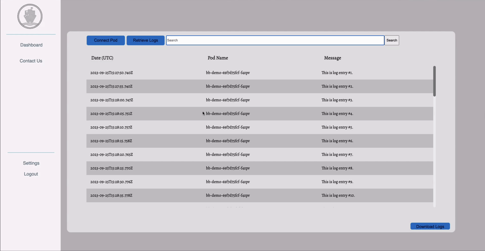

<p align="center">
  
</p>
.
Locating errors in Kubernetes pods can be challenging, as developers are required to sift through extensive log data from all pods in the terminal, especially when an application is running on many pods.

Now, developers can use LogKaptain, an open source web application, that offers a dashboard view of all logs from each pod, allowing developers to locate and handle pod errors in a timely manner. Developers can search for keywords to filter log messages, export the log data as a CSV, and connect to a Jira account to create tickets.

With LogKaptain, developers can streamline the error location process, ensuring efficient troubleshooting and smoother application management.
## How It Works
### Prerequisites
This application requires you to have [Docker](https://www.docker.com/products/docker-desktop/) and [Kubectl](https://kubernetes.io/docs/tasks/tools/) installed in order to view your local kubernetes cluster. Please download based on your operating system from the official website.
#### Step 1: Containerize your App
_You can read detailed instructions [here](https://docs.docker.com/get-started/02_our_app/)._

Create your Dockerfile
```
#syntax = docker/dockerfile:1
FROM node:18-alpine
WORKDIR /app
COPY . . 
RUN yarn install --production
CMD ["node", "src/index.js"]
EXPOSE 3000
```


Build the app’s image
```
$ docker build -t getting-started .
```

#### Step 2: Orchestrate your Kubernetes Cluster
_You can read detailed instructions [here](https://docs.docker.com/get-started/kube-deploy/)._
	
Turn on Kubernetes in Docker Desktop

#### Step 3: Deploy your Containerized App to Kubernetes
_You can read detailed instructions [here](https://docs.docker.com/get-started/kube-deploy/)._ 

Create a Kubernetes YAML file 
In this file, you should have two objects, separated by the ---. 
The first is the deployment which describes a scalable group of identical pods
The second is a NodePort service which will route traffic from a port on your host to a port inside the pods allowing you to reach your app from the network.

Import YAML File
Add your YAML file /server/k8s folder of the LogKaptain application.

Example of YAML file
```
apiVersion: apps/v1
kind: Deployment
metadata:
   name: bb-demo
   namespace: default
spec:
   replicas: 1
   selector:
      matchLabels:
         bb: web
   template:
      metadata:
         labels:
            bb: web
      spec:
         containers:
            - name: bb-site
              image: getting-started
              imagePullPolicy: Never
---
apiVersion: v1
kind: Service
metadata:
   name: bb-entrypoint
   namespace: default
spec:
   type: NodePort
   selector:
      bb: web
   ports:
      - port: 3000
        targetPort: 3000
        nodePort: 30001
```


## Clone LogKaptain Github Repository
Install the dependencies: 
```
$ npm install
```


Run application with: 
```
$ npm run dev
```


The app will run on `http://localhost:5173`

## Sign Up
For first-time users, a quick registration is required. Go to www.logkaptain.com and click the sign up button. If you’re already a user, proceed with logging in.

<p align="center">
  
</p>

## Connect Pods
The "Connect Pod" button is currently inactive, but will be fully functional in future updates. When you log in for the first time, simply click the "Connect Pod" button to seamlessly link your Kubernetes pods with your LogKaptain account.
## Optional: Connect Jira (Atlassian)
If your company uses Jira for issue tracking, you can editing the following file located in server/controllers/issueController.js to integrate Jira for bug tracking. Please update jiraApiUrl, jiraUsername, jiraPassword, and key to your respective Jira account. 
```
// Jira API endpoint and authentication credentials
const jiraApiUrl = 'https://yourDomain.atlassian.net/rest/api/2/issue';
const jiraUsername = 'your atlassian email address';
const jiraPassword = 'your api token'; // Atlassian API token you can generate in Jira

// Jira issue data (We can customize this based on our requirements)
const issueData = {
  fields: {
    project: {
      key: 'your project key on Jira', 
    },
    summary: summary,
    description: description,
    issuetype: {
      name: 'Bug',
    },
  },
};
```

## Using LogKaptain
After completing the initial setup, you can access the latest logs from all your Kubernetes pods by clicking on "Retrieve Logs." 

<p align="center">
  
</p>

Utilize the search bar to quickly and efficiently find specific log information you’re looking for.


<p align="center">
  
</p>

Obtain a portable version of your logs by clicking the Download Logs button to export your logs as a CSV. 

<p align="center">
  
</p>

Create a Jira ticket from LogKaptain to streamline issue tracking, promote improved collaboration among development teams, and ensure that tasks are prioritized based on their importance and impact.

<p align="center">
  
</p>

## Team
ECRI 42 OSP 1: [Carolina Bonitatis](https://www.linkedin.com/in/carolina-bonitatis), [Christopher Le](https://www.linkedin.com/in/chrisle96), [Gabriela Passentino](https://www.linkedin.com/in/gabriela-passentino/), [Micah Nelson](https://www.linkedin.com/in/micahanelson), [Sharmarke Youssouf](https://www.linkedin.com/in/sharmarkeyoussouf/)

## Mentor
[Hazel Bolivar](https://www.linkedin.com/in/hazelbolivar)
